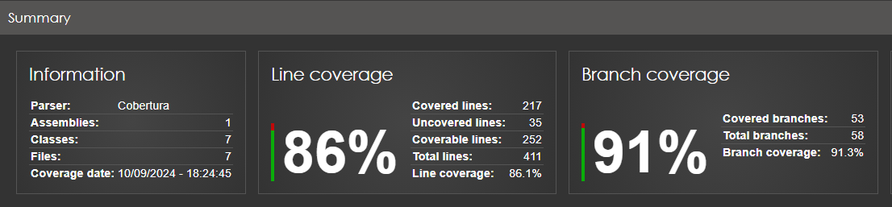

# File Synchronization Application

## Overview

This application is designed to synchronize files between a source folder and a replica folder at specified intervals. It logs all synchronization operations.

## Features

- **Automatic Synchronization**: Keeps the replica folder in sync with the source folder at regular intervals.
- **Logging**: Records all operations, such as file creation, deletion, and updates.
- **Configurable Settings**: Allows users to specify the source and replica folders, log file path, and synchronization interval.

## Getting Started

### Prerequisites

- .NET 8.0 SDK
- A Windows environment (for directory paths)

### Installation

1. Clone the repository:
   ```bash
   git clone https://github.com/sergioferreira0122/FileSynchronizationApp.git
   cd FileSynchronizationApp
   cd TestTask
   ```

2. Build the project:
   ```bash
   dotnet build
   ```

3. Run the application:
   ```bash
   dotnet run <sourceFolder> <replicaFolder> <logFilePath> <syncIntervalInSeconds>
   ```

### Usage

To run the application, you need to provide four arguments:

1. **sourceFolder**: The path to the source folder.
2. **replicaFolder**: The path to the replica folder.
3. **logFilePath**: The path where the log file will be stored.
4. **syncIntervalInSeconds**: The interval at which the synchronization will occur, in seconds.

Example:
```bash
dotnet run "C:\Source" "C:\Replica" "C:\Logs\sync.log" 600
```

This command will synchronize the contents of `C:\Source` with `C:\Replica` every 10 minutes, logging the operations in `C:\Logs\sync.log`.

### Testing

The application includes unit tests written using xUnit.

To run the tests:
```bash
dotnet test
```

### Coverage Result


